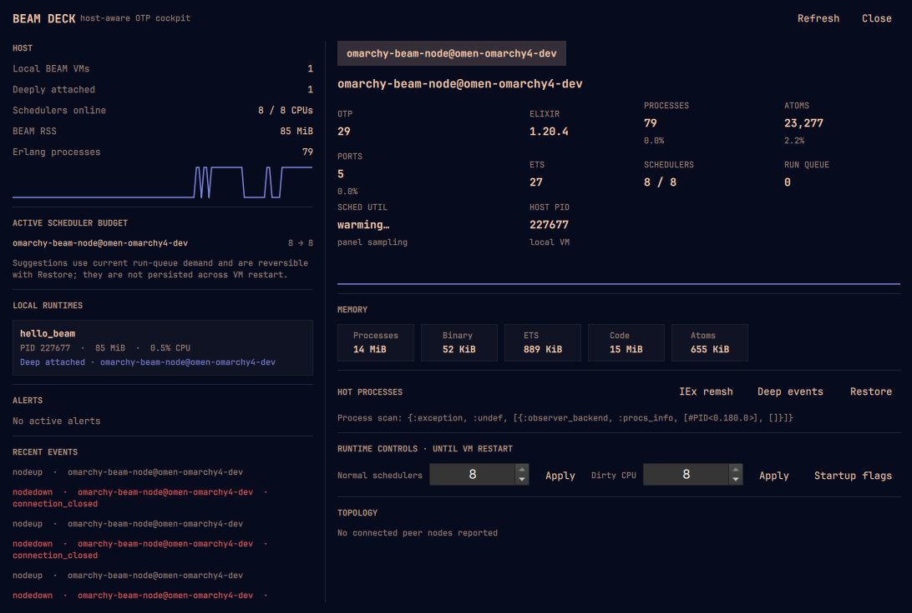

# BEAM Deck

[](https://github.com/nshkrdotcom/omarchy-beam-deck)
[](LICENSE)
[](https://github.com/nshkrdotcom/omarchy-beam-deck)
[](#requirements-and-external-dependencies)

**A native Omarchy control surface for understanding what your Erlang and Elixir runtimes are doing right now — and what changed when something went wrong.**

BEAM Deck is an **agentless BEAM/OTP cockpit and investigation workspace for Omarchy Quattro**. It discovers local Erlang VMs from the host, attaches to reachable distributed nodes using standard OTP distribution, and turns runtime telemetry into a focused desktop workflow: host and node health, incidents, process and ETS diagnostics, bounded historical evidence, persistent watch targets, crash context, and reversible scheduler controls.

It is intentionally local-first. You do not add a BEAM Deck dependency to the applications you monitor, ordinary inspection does not install a resident target agent, and mutating actions are explicit, live-state-gated, and designed to be reversible where OTP permits it.



## Features

- **Zero application dependencies** — no Hex package, instrumentation library, or BEAM Deck service is required inside the application being observed.
- **Automatic host census** — discovers local `beam.smp` processes through Linux `/proc`, including non-distributed Erlang/Elixir workloads that cannot expose OTP internals.
- **Deep OTP telemetry** — for named nodes, surfaces VM memory, process/atom/port capacity, run queues, scheduler state and utilization, ETS metadata, peer topology, hot processes, and runtime identity.
- **Evidence-first incident triage** — groups active symptoms into incidents while keeping directly observed facts, nearby correlations, and heuristic forecasts visibly distinct.
- **Flight recorder** — retains a bounded in-memory timeline of compact frames for before/after comparison, runtime-disappearance context, and selected-range export.
- **Focused process diagnostics** — inspects one live PID with bounded status, argument-free stack metadata, focused ancestry, mailbox/memory/reductions, and shared-binary reference summaries without collecting messages or arbitrary process state.
- **Metadata-only ETS lens** — ranks bounded table metadata by memory or element count and lets you pivot to the current table owner without reading keys or values.
- **Persistent watchlist** — pins exact node names and registered process names; registered-name pins follow PID replacement instead of pretending PIDs are durable identities.
- **Conservative resource forecasts** — shows process, atom, and port capacity trajectories only after minimum sample, time-span, fit, and stability gates are satisfied. Binary and ETS trends are growth signals, not fabricated exhaustion deadlines.
- **Crash triage** — when a local runtime disappears, can correlate it with a fresh, bounded `erl_crash.dump` header from that runtime's previously observed working directory.
- **Deep Events on OTP 28+** — explicitly enables a temporary isolated trace-session probe for long GC, long scheduling, mailbox growth, large heaps, and busy ports. Ordinary inspection does not require the probe.
- **Reversible scheduler controls** — adjust online normal/dirty schedulers, restore original observed values, or trial the complete local scheduler-budget recommendation under a short lease that rolls back unless kept.
- **Private diagnostic export** — creates a bounded local ZIP from an allowlisted evidence set rather than dumping arbitrary runtime state.
- **Native critical notifications** — critical incident transitions can surface through Omarchy desktop notifications with cooldown protection.
- **One-click `IEx --remsh`** — opens an interactive shell to an explicitly selected connected node through Omarchy's terminal execution path.
- **Keyboard-native operation** — integrates with Omarchy's bar-panel shortcuts and `PanelKeyCatcher` conventions, with mnemonic workspace keys, Vim/arrow navigation, editor-safe key handling, and an in-panel shortcut guide.
- **Mise-first onboarding** — a missing Erlang/Elixir toolchain becomes an actionable setup state instead of a broken panel or silent install.

## What's New in 1.1

BEAM Deck 1.1 keeps the live **Cockpit** as the fast operational overview and adds a dedicated **Investigate** workspace for evidence-driven debugging.

| Workspace | Purpose |
|---|---|
| **Triage** | Prioritized incidents, evidence classes, nearby events, watchlist context, forecasts, and incident actions. |
| **Flight recorder** | Browse retained frames, compare resource deltas and sampled hot sets, inspect historical state, and export a selected range. |
| **Process** | Inspect one captured process identity, refresh it deliberately, pin its registered name, open `remsh`, or request GC from fresh live state. |
| **ETS lens** | Inspect bounded metadata-only table rankings and pivot to table owners. |
| **Watchlist** | Keep a durable working set of exact nodes and registered process names across BEAM Deck restarts. |
| **Budget trial** | Review the whole current local scheduler recommendation, apply it under a lease, then Keep or Revert. |

The 1.1 UI also makes the **live vs. historical boundary** explicit. Historical recorder frames are read-only for runtime mutation. Process GC and scheduler changes require fresh live state and the current VM incarnation rather than acting on stale evidence.

## Requirements and External Dependencies

### Required runtime

- **Omarchy Quattro** is the supported desktop environment.
- **Erlang/OTP 27+** and **Elixir 1.18+** are required for the BEAM Deck helper and deep OTP telemetry.
- The supported-version CI matrix targets OTP 27 / Elixir 1.18, OTP 28 / Elixir 1.19, and OTP 29 / Elixir 1.20.
- **Mise** is the recommended Omarchy-native toolchain path. If Erlang/Elixir are missing, BEAM Deck guides you to:

```bash
mise use -g erlang@latest elixir@latest
```

### Runtime behavior

- BEAM Deck adds **no dependency to monitored applications**.
- Deep telemetry requires a reachable distributed node started with `--sname` or `--name`.
- Local non-distributed BEAM processes are still visible through `/proc`, but OTP internals are not available until distribution is enabled.
- Supported diagnostics use standard OTP facilities such as distribution, `runtime_tools`, process metadata, ETS metadata, trace sessions, and VM counters.
- **`jq` is optional** and is used only by `beam-deck-remsh` to resolve a configured node's `cookie_env` reference from `~/.config/beam-deck/config.json`.
- Erlang distribution is a privileged remote-control channel, not a read-only security boundary. Keep cookies and distribution connectivity on trusted networks.

## Install

Install and enable BEAM Deck from GitHub:

```bash
omarchy plugin add https://github.com/nshkrdotcom/omarchy-beam-deck.git --enable
omarchy restart shell
```

The status-bar widget should appear in the configured bar section after the shell restarts.

For local plugin development, keep the checkout directly at:

```text
~/.config/omarchy/plugins/nshkr.beam-deck
```

Then rescan, enable, and restart the shell:

```bash
omarchy-shell shell rescanPlugins
omarchy plugin enable nshkr.beam-deck --section right
omarchy restart shell
```

### Update

Update a Git-managed installation through Omarchy, then restart the shell:

```bash
omarchy plugin update nshkr.beam-deck
omarchy restart shell
```

### Remove

Before removing BEAM Deck, **revert any active scheduler trial** and restore any scheduler changes you do not want to leave in place.

```bash
omarchy plugin remove nshkr.beam-deck
omarchy restart shell
```

Removing the plugin does not uninstall Erlang/OTP or Elixir and does not modify your monitored applications.

Optional BEAM Deck user state can be removed separately:

```bash
rm -rf ~/.config/beam-deck ~/.cache/beam-deck ~/.local/state/beam-deck
```

## Usage

### Quick Start

#### 1. Start a distributed BEAM application

For full OTP telemetry, give the application a node name:

```bash
# Phoenix / Mix
iex --sname my_app -S mix phx.server

# Plain IEx
iex --sname demo

# Rebar3
rebar3 shell --sname erl_node
```

A non-distributed local VM will still appear in the host census with OS-level visibility.

#### 2. Open BEAM Deck

Click the BEAM Deck icon in the Omarchy bar, use Omarchy's bar-position shortcut, or call the shell IPC directly:

```bash
omarchy-shell shell toggle nshkr.beam-deck '{}'
```

Omarchy Quattro maps **`Super+Ctrl+1` through `Super+Ctrl+9`** to bar panels by position. BEAM Deck deliberately does not install or rewrite a global Hyprland binding of its own, so moving the widget in your bar changes which position number opens it without creating a second shortcut system.

#### 3. Use the Cockpit for orientation, Investigate for evidence

The **Cockpit** answers the fast questions: what is running, what is attached, what is under pressure, which node is selected, and whether something needs attention. **Investigate** is where you follow an incident through retained frames and focused diagnostics.

### Keyboard Shortcuts

BEAM Deck uses Omarchy's native panel keyboard model instead of a separate modal keymap. Focused text fields, text editors, combo boxes, spin boxes, and buttons get first refusal; panel shortcuts apply when the focused control does not consume the key.

| Key | Action |
|---|---|
| `Super+Ctrl+1` … `Super+Ctrl+9` | Toggle the bar panel at that Omarchy bar position. |
| `C` | Open **Cockpit** and return to live state. |
| `I` | Open **Investigate → Triage**. |
| `T` | Investigate: **Triage**. |
| `F` | Investigate: **Flight recorder**. |
| `P` | Investigate: **Process**. |
| `E` | Investigate: **ETS lens**. |
| `W` | Investigate: **Watchlist**. |
| `B` | Investigate: **Budget trial**. |
| `R` | Refresh current telemetry. |
| `G` | **Go live** from a historical selection. |
| `←` / `→` or `H` / `L` | Change the selected Cockpit node or move between Investigate tabs. |
| `↑` / `↓` or `K` / `J` | Scroll the current Cockpit/Investigate context. |
| `Tab` / `Shift+Tab` | Follow Omarchy/Qt focus and adjacent-panel navigation semantics. |
| `Esc` | Close BEAM Deck. |
| `?` | Toggle the built-in shortcut guide. |

`H/J/K/L` remain navigation keys because that is the Omarchy `PanelKeyCatcher` convention; they are not repurposed as BEAM Deck actions. That is why **Go live is `G`, not `L`**.

### Cockpit

The Cockpit is the always-live overview. It presents:

- **Attention** — active incidents, qualified trends, and watchlist problems with fast jumps into Triage, Recorder, or Watchlist.
- **Host** — local BEAM VM count, attached nodes, scheduler density, total BEAM RSS, process count, and recent host history.
- **Scheduler budget** — advisory local scheduler recommendations with an explicit jump to the reversible trial workflow.
- **Local runtimes** — `/proc`-discovered VMs, including OS-only processes that are not distributed nodes.
- **Selected node detail** — OTP version/identity, run queues, per-scheduler utilization, VM limits, memory composition, hot processes, registered-name churn, runtime controls, and peer topology.
- **Alerts and recent events** — current operational signals without silently upgrading correlation into causality.

Use `←/→` or `H/L` to move between attached/discovered nodes while the Cockpit has keyboard focus.

### Two Visibility Levels

BEAM Deck distinguishes what the host can observe from what OTP can expose.

1. **OS-only visibility** works automatically for local `beam.smp` processes. It includes process identity, bounded/redacted command context, working directory, RSS/virtual memory, threads, and sampled host CPU information where available.
2. **Deep OTP visibility** requires a reachable named node. It adds VM memory and limits, scheduler/run-queue telemetry, hot processes, peers, focused process/ETS diagnostics, and runtime controls.

The UI keeps these states explicit so a locally detected VM is not presented as though BEAM Deck successfully authenticated to it.

## Everyday Guides

### Connecting a Phoenix or Elixir Application

Start the development VM with distribution enabled:

```bash
# Phoenix / Elixir
iex --sname web -S mix phx.server

# Long-running Mix application
elixir --sname worker -S mix run --no-halt
```

BEAM Deck discovers local named nodes through EPMD and correlates the distributed identity with the local OS process when possible.

### Investigating an Incident

A useful 1.1 workflow is:

1. Open **Triage** and identify the active symptom plus its evidence class.
2. Open **Flight recorder** to compare nearby retained frames instead of reasoning only from the newest snapshot.
3. Pivot to **Process** or **ETS** when the evidence identifies a concrete target worth deeper inspection.
4. Press **`G`** or click **Return to live** before any mutating action.
5. Reinspect a live process immediately before GC; stale process reports do not authorize actions.
6. Export a bounded diagnostics bundle only if you need to preserve or share the evidence.

Forecasts are deliberately conditional. An ETA means approximately **“if this qualified observed trajectory continues”**; it is not a probability of failure. A nearby event is evidence of timing, not proof of cause.

### Diagnosing a Hot Process

From the selected node's hot-process list, open **Inspect / GC** or press **`P`** after selecting the relevant process through the UI.

The process report can include mailbox size, memory, reductions, current/initial call metadata, a bounded argument-free stack, focused ancestry, and shared off-heap binary reference summaries. It intentionally does **not** collect process messages, arbitrary state, arguments, or a full dictionary.

If you choose GC, BEAM Deck requires a fresh live report for the same VM incarnation. Process GC can pause the target and may not reclaim the memory you expect, so it remains an explicit action rather than automatic remediation.

### Safe Scheduler Work

BEAM Deck provides two distinct scheduler workflows:

- **Direct node controls** let you deliberately change online normal/dirty scheduler counts and later restore the originally observed values.
- **Budget trial** evaluates the whole attached-local-node recommendation as one short leased change set.

For the safer trial path:

1. Open **Investigate → Budget trial** (`B`).
2. Review every proposed local scheduler change.
3. Confirm and begin the trial.
4. Observe the application under the changed scheduler budget.
5. Choose **Keep** if the result is desirable, **Revert now** if it is not, or allow the lease to expire.

Rollback is conditional rather than destructive: if a VM restarted or another actor changed the scheduler value, BEAM Deck does not blindly overwrite the newer state. A failed restoration stays visible and retryable.

**Keep** ends the lease but does not erase the first recorded original value; the normal **Restore** path remains available.

For startup-only sizing, generate an `ERL_FLAGS` line without editing the project:

```bash
./bin/beam-deck-profile --schedulers 8 --dirty-cpu 4 --dirty-io 2
```

### Monitoring Explicit Remote Nodes

Remote nodes are configured explicitly; BEAM Deck does not crawl the LAN. Create or extend `~/.config/beam-deck/config.json`:

```json
{
  "nodes": [
    {
      "name": "api@prod-box",
      "cookie_env": "BEAM_DECK_PROD_COOKIE",
      "required": true,
      "expected_peers": ["worker@prod-box"]
    }
  ]
}
```

Then make `BEAM_DECK_PROD_COOKIE` available to the environment inherited by the **actual Omarchy shell process**. Exporting it only in an unrelated terminal does not update an already-running shell.

- `cookie_env` stores an environment-variable **name**, not the cookie value.
- `required: true` makes an unavailable configured node an actionable signal.
- `expected_peers` declares directional topology expectations instead of asking BEAM Deck to guess what the cluster should look like.
- Remote schedulers never consume the local host's scheduler-budget capacity.

### Short Names and Long Names

BEAM Deck defaults to short distribution names for local development. For long-name environments:

```bash
export BEAM_DECK_LONGNAMES=1
export BEAM_DECK_NODE_HOST=workstation.mycorp.internal
```

The configured host name must resolve correctly, and your distribution naming mode must be compatible with the target nodes.

### Deep Events (OTP 28+)

**Deep Events** is an explicit temporary diagnostic mode, not continuous profiling. On a capable OTP 28+ node it can surface metadata for long garbage collections, long scheduling events, mailbox growth, large heaps, and busy ports through an isolated trace session.

Turning it off — or closing/disconnecting under normal conditions — tears down BEAM Deck-owned tracing and attempts to unload the temporary namespaced probe. See [SECURITY.md](SECURITY.md) for the exact trust and cleanup boundaries.

### Watchlist

The Watchlist keeps a small, persistent working set in:

```text
~/.config/beam-deck/watchlist.json
```

- **Node pins** track exact node names.
- **Registered-process pins** resolve the current registered PID instead of persisting a transient PID.
- Bounded targeted checks can continue while the full panel is closed.

This is deliberately not a regex subscription engine or a durable PID database.

### Diagnostic Export and Crash Triage

Diagnostic export is manual, bounded, and local. The archive contains a fixed evidence set and excludes raw configuration, raw helper logs, raw crash dumps, environment variables, process messages/state, full dictionaries, binary contents/addresses, and ETS contents.

Still review every export before sharing it. Node names, module names, registered names, stack metadata, labels, and crash slogans can reveal internal architecture even when credentials are redacted.

Crash triage is similarly bounded: BEAM Deck checks only the vanished local runtime's previously observed working directory for a fresh `erl_crash.dump` match. It does not scan the filesystem and does not claim that temporal proximity proves why the VM exited.

## Desktop IPC and Shell Commands

BEAM Deck exposes the normal Omarchy shell surface for scripting, custom keybindings, or debugging:

```bash
# Toggle the panel
omarchy-shell shell toggle nshkr.beam-deck '{}'

# Open or close explicitly
omarchy-shell shell summon nshkr.beam-deck '{}'
omarchy-shell shell hide nshkr.beam-deck

# Force an immediate telemetry refresh
omarchy-shell nshkr.beam-deck refresh

# Print the latest JSON snapshot
omarchy-shell nshkr.beam-deck status

# Ping the background service
omarchy-shell nshkr.beam-deck ping
```

If you want a custom global binding beyond Omarchy's `Super+Ctrl+1–9` bar-position bindings, add it in your own Omarchy/Hyprland configuration. BEAM Deck does not silently modify desktop keybindings.

## Configuration

BEAM Deck works with no user configuration for ordinary local discovery. A missing config uses bounded defaults; existing 1.0 settings deep-merge with the 1.1 defaults.

Important top-level defaults include:

| Key | Default | Purpose |
|---|---:|---|
| `poll_interval_ms` | `2000` | Lightweight host/node refresh cadence. |
| `deep_interval_ms` | `5000` | Deep process sampling cadence while the panel is open. |
| `history_points` | `450` | Retained light-history points. |
| `max_process_scan` | `100000` | Safety ceiling for process-scan handling. |
| `mailbox_warn` | `5000` | Mailbox warning threshold. |
| `mailbox_critical` | `50000` | Critical mailbox threshold. |
| `mailbox_rate_warn` | `1000` | Message growth-rate warning threshold. |
| `process_usage_warn` | `0.80` | Process-table capacity warning fraction. |
| `atom_usage_warn` | `0.80` | Atom-table capacity warning fraction. |
| `run_queue_per_scheduler_warn` | `1.0` | Run-queue warning ratio per scheduler. |
| `flight_recorder_points` | `150` | Compact recorder frame retention. |
| `budget_trial_lease_ms` | `30000` | Maximum scheduler trial lease. |

1.1 also includes bounded configuration for forecasts, incidents, notifications, watchlists, focused diagnostics, crash matching, exports, and Deep Events thresholds. See [docs/CONFIGURATION.md](docs/CONFIGURATION.md) for the full contract and [config/config.example.json](config/config.example.json) for the complete example.

Invalid JSON, unsafe reads, duplicate keys, or unsupported value shapes do not become arbitrary commands. BEAM Deck surfaces a configuration warning and falls back to bounded behavior where defined.

### File Locations

| Purpose | Default path |
|---|---|
| User configuration | `~/.config/beam-deck/config.json` |
| Persistent watchlist | `~/.config/beam-deck/watchlist.json` |
| Build/dependency cache | `~/.cache/beam-deck/` |
| Helper log | `~/.local/state/beam-deck/beam-deckd.log` |
| Explicit diagnostic exports | `~/.local/state/beam-deck/exports/` |

XDG overrides are honored where supported. Recorder/history data is otherwise memory-resident and is not restored after a helper restart.

## Security and Privacy

BEAM Deck minimizes what it collects before relying on redaction:

- **No permanent target agent** for ordinary inspection.
- **No arbitrary LAN scan**; discovery is local EPMD plus explicitly configured/observed node relationships.
- **No literal cookie requirement in config**; explicit nodes reference `cookie_env` names.
- **Cookie redaction** for known distribution-cookie arguments before telemetry reaches the UI.
- **No arbitrary process-state browser**; focused reports exclude messages, arbitrary state, arguments, and general dictionary contents.
- **No ETS contents**; the ETS lens is metadata-only.
- **Bounded collection and export** across process reports, table enumeration, recorder history, crash reads, and ZIP output.
- **Historical mutation lockout** and **VM-incarnation checks** for sensitive actions.
- **Conditional scheduler rollback** rather than blind overwrite after a conflicting external change or VM restart.

Erlang distribution is powerful by design. Possession of the correct cookie and network access can permit capabilities far beyond BEAM Deck's UI. Treat distribution access as privileged.

`beam-deck-remsh` may pass a selected cookie through IEx arguments. Same-user or privileged OS observers may be able to inspect process arguments; telemetry redaction is not OS-level credential isolation.

Read [SECURITY.md](SECURITY.md) before using remote nodes or mutating controls in a sensitive environment.

## Development and Testing

Run repository-local static/QML/JavaScript/shell contracts:

```bash
make static
```

Run the complete available release gate through Mise:

```bash
mise exec -- make check
```

Run the launcher/private-EPMD protocol harness:

```bash
mise exec -- make protocol
```

Useful targeted commands:

```bash
# QML/source/shell/JavaScript contracts
./test/static.sh

# Elixir daemon unit tests
cd daemon && mix test

# Disposable real-peer OTP integration tests
cd daemon && BEAM_DECK_INTEGRATION=1 mix test

# Strict analysis
cd daemon && mix credo --strict
cd daemon && mix dialyzer
```

The repository includes pure UI-state tests, source contracts, Elixir unit tests, real OTP-peer integration cases, and an actual-launcher protocol harness. Real Omarchy/Quickshell rendering, focus, keyboard behavior, and desktop lifecycle still belong in the desktop acceptance pass; syntax-only checks are not a substitute for running the plugin in Omarchy.

## Documentation

- [Architecture](docs/ARCHITECTURE.md) — ownership, lifecycle, collection/control boundaries, persistence, and transport.
- [Configuration](docs/CONFIGURATION.md) — exact defaults, bounds, node configuration, and environment behavior.
- [Protocol](docs/PROTOCOL.md) — JSONL envelopes and UI/helper command contract.
- [1.1 Implementation Design](docs/IMPLEMENTATION-1.1.md) — reviewed design decisions and feature-to-test traceability.
- [Validation](docs/VALIDATION.md) — release gates and required real-environment checks.
- [Security](SECURITY.md) — trust model, data minimization, cookies, mutation safety, and recovery boundaries.
- [Changelog](CHANGELOG.md) — release history.

## License

BEAM Deck is open-source software licensed under the [MIT License](LICENSE).
